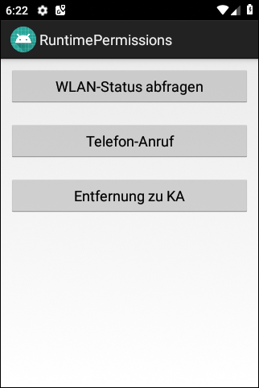
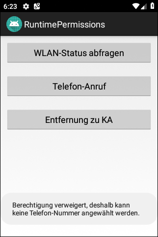
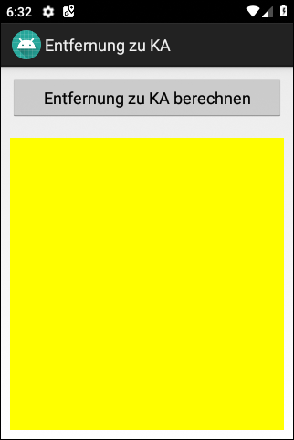
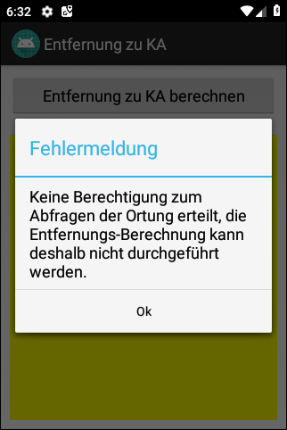

# Android-App "Runtime Permissions" #

 

Die App demonstriert die mit Android 6.0 eingeführten 
[Runtime Permissions](https://developer.android.com/guide/topics/permissions/overview#runtime).

 

----

## Screenshots ##

 

 &nbsp; 

 

 &nbsp; 

 

----

## License ##

 

See the [LICENSE file](LICENSE.md) for license rights and limitations (BSD 3-Clause License).

 